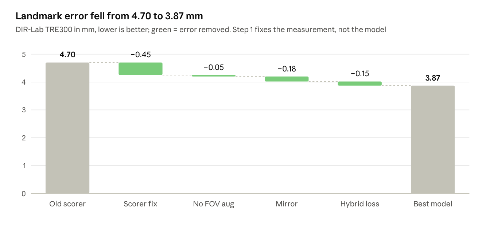

# Single-CT Lung Motion: Road to 3.8 mm

5 Oct 2026. Copy of the claude.ai doc https://claude.ai/code/artifact/9d861ebd-a480-424c-9729-9007cbf17e06 (the doc is the live version).

## Summary

From one planning CT, the best model predicts inhale-to-exhale lung motion with a landmark error of **3.87 mm on DIR-Lab** (10 patients) and **4.46 mm on POPI** (6 patients), 4.09 mm over all 16. With no motion the error is 8.46 mm on DIR-Lab, so the model removes 54% of it.

- **Best model:** the TCIA3.5 decoder (82 TCIA scans, 64³ crops, 100 epochs) trained with the hybrid loss (motion L1 + 10 × image match + 0.1 × smoothness), scored with left-right mirror test-time augmentation, mean over epochs 96–100.
- **What moved the number:** fixing the scorers, using full-lung views, the hybrid loss and mirror averaging. Changes to network size, augmentation and labels gave less than 0.1 mm each.
- **What limits it:** breath depth. One CT cannot show how deeply a patient breathes, and the deep breathers (DIR-Lab case 8, POPI ng) carry most of the error.
- **Status of the claim:** the hybrid loss + mirror beats the old loss on 11 of 16 patients (−0.11 mm), but this is not significant (Wilcoxon p = 0.14). Second seeds of both losses finish on 6 Oct 2026.

One-line claim: from a single planning CT the model reaches 3.9 mm on DIR-Lab and 4.5 mm on POPI, in the range of published models that also need a breathing signal (3.3–4.2 mm).

## Problem and setup

The task is to predict a patient's full breathing motion from **one 3D planning CT**, with no 4D-CT, CBCT or breathing trace at treatment (clinical constraint recorded 30 Sep 2026).

| Part | What we use |
| --- | --- |
| Training data | TCIA 4D-Lung: 82 4D-CT scans from 20 patients, 10 phases each, resampled to 2 mm isotropic 160³, centred on the lung |
| Labels | Elastix B-spline registration between phases (Mattes mutual information), lung-masked; field in 2 mm voxels |
| Network input | One CT phase converted to attenuation (µ), min-max normalised, plus the reference and target phase indices |
| Network | UNetCRBDecoder: 5-level U-Net, plain encoder, conditional residual blocks in the decoder, 3-channel motion field, 1.07 M parameters |
| Test set 1 | DIR-Lab 4D-CT, 10 patients, 300 expert landmarks per case; input CT_06 (T50, exhale), predicted motion to T00 |
| Test set 2 | POPI, 6 patients; input phase 00, predicted motion to the published reference phase |
| Main metric | TRE300: mean distance (mm) between predicted and expert landmark positions, T00→T50 |

Test patients never appear in training: DIR-Lab and POPI are separate datasets from TCIA. All headline numbers use the corrected 2 mm scorer (section Code verification).

## How we got from 4.70 to 3.87 mm

The biggest single step was fixing how DIR-Lab was fed to the network (4.70 → 4.25 mm); after that, only the hybrid loss and mirror averaging moved the number by more than 0.1 mm. All values are DIR-Lab TRE300 in mm.



The scorer fix removed the most error; mirror averaging and the hybrid loss together removed another 0.33 mm. Every bar after the first uses the same rule (mean of the last 5 epochs); the first step changes how DIR-Lab is measured, not the model.

1. **Up to 25 Sep: first population models (TCIA3, TCIA3.1, TCIA4, MagFT, AmpHead).** TCIA3 scored 4.70 mm on the old path. Fine-tunes that pushed motion size (MagFT, MagMatch, AmpHead) were judged on this path, and those conclusions were later withdrawn.
2. **29 Sep: scorer bug found and fixed (4.70 → 4.25).** The old path squeezed each DIR-Lab CT into 160³ (anisotropic 1.5–3.1 mm voxels) and used a different brightness scale. The new `eval_dir_tcia3_iso2mm_v2.py` resamples to 2 mm iso, centres on the lung and uses the training normalisation. Direction agreement with Elastix rose from 0.32 to 0.85.
3. **29 Sep: scorer verified, error source measured.** `verify_iso2mm.py` passed all four checks. The scale oracle showed the remaining error is mostly breath depth: a per-case size correction would give 3.60, but one CT cannot predict depth (R² below 0).
4. **25–29 Sep: TCIA3.5, augmentation off (4.25 → 4.20).** Same recipe as TCIA3 without field-of-view augmentation; epochs 96–100 averaged 4.20 (epoch 92 alone 4.18).
5. **30 Sep: small-model tests on TCIA-lite.** Whole-lung views (full160, 4.58) and a deeper net (deep128, 4.59) beat 64³ crops (4.74); a half-width net was worse (4.84). The whole-lung view was kept.
6. **1 Oct: mirror averaging (4.20 → 4.02).** Averaging each prediction with the left-right mirrored one helped the crop-trained TCIA3.5 by 0.18. Ensembles of old models gave no gain (4.02), because all models shared the same errors.
7. **1 Oct: label and input ideas ruled out.** Push-style labels (−0.09), full-resolution relabelling, brightness matching and EPE loss all stayed under the 0.1 mm bar.
8. **2 Oct: hybrid loss, first change to pass the fixed rule.** Adding an image-match term on the small model gave 4.17 vs 4.47 (−0.30). Seed 2 repeated it (4.16, 9/10 cases better).
9. **4 Oct: hybrid loss on the main model (best: 3.87).** TCIA3.5-hybrid scored 4.11 plain and **3.87 with mirror** (epochs 96–100), against 4.20 and 4.02 for the old loss.
10. **3–5 Oct: checks on a second dataset.** On POPI the hybrid loss alone was worse (4.84 vs 4.56) but hybrid + mirror was slightly better (4.46 vs 4.50). Over 16 patients: 4.09 vs 4.20, not significant.

The rule used for every step was fixed before results: the mean of the last 5 epochs must be more than 0.1 mm better than the baseline, with at least 7 of 10 cases lower. Single-epoch best scores were never used, because epoch-to-epoch swing is about ±0.1 mm.

## The hybrid loss: why, how, and the weights

The hybrid loss was the first change to pass the fixed rule; its weights were an educated guess set before training, and the one test of a different weight (30) made it worse.

**Why we tried it (1 Oct 2026).** Every earlier change gave less than 0.1 mm. Two causes were left: breath depth is invisible in one CT, and the model copies Elastix's own mistakes. Training error had reached the measured label-noise floor (about 0.25 vs 0.165), so the model was learning Elastix very well, including its errors. The idea came from the literature: RMSim trains on image similarity plus smoothness instead of labels alone, and work on noisy labels shows models first learn the general rule, then memorise label errors.

**What it does.** The loss also checks whether the images actually line up, a signal that does not share Elastix's mistakes:

```latex
L = L_{dvf} + 10 \cdot L_{img} + 0.1 \cdot L_{smooth}
```

- L_dvf: lung-masked L1 between Elastix label and prediction (the old loss, unchanged).
- L_img: mean |target CT − reference CT warped by the prediction|, over the lung mask dilated by 2 voxels so the diaphragm edge counts.
- L_smooth: mean squared difference between neighbouring motion vectors.
- On the small model, the image term compares the target with the reference after the same flip, shift and zoom but before brightness and noise augmentation, so it compares like with like.

**How the weights were chosen (educated guess, not tuned).** Each term was scaled to a similar size at the start of training: the image L1 is about 0.02, so ×10 gives about 0.2, close to the motion L1 of about 0.25. Smoothness got a light 0.1. The weights were fixed before any result and never tuned on DIR-Lab, because DIR-Lab is the test set and tuning on it would inflate the result.

**How it was tested.**

1. A gate in every run stops training unless: zero weights give exactly the old loss; the Elastix label lines the images up better than zero motion, with and without flip, shift and zoom; the extra terms produce a gradient.
2. A synthetic test (a shifted Gaussian blob): right-sign motion scored 0.0, wrong-sign 0.083, and the image term alone pulled a zero guess toward the true shift.
3. One change at a time: a copy of the small-model script with only the loss changed, compared against the same recipe.
4. A rule fixed before results: last-5-epoch mean more than 0.1 mm better and at least 7 of 10 cases better.

**What happened.**

| Run | Image weight | TRE300 (mm, last 5 epochs) | vs old loss | Verdict |
| --- | --- | --- | --- | --- |
| Small, old loss | 0 | 4.47 | baseline | |
| Small, hybrid seed 1 | 10 | 4.17 | −0.30, 7/10 | passed |
| Small, hybrid seed 2 | 10 | 4.16 | −0.31, 9/10 | passed |
| Small, hybrid | **30** | 4.34 | −0.13 vs old, but +0.17 vs weight 10 | worse than 10 |
| Main, hybrid (+ mirror) | 10 | 4.11 (3.87) | −0.09 (−0.15) | best model |

**Weight 30 (3 Oct).** Tripling the image weight made it the larger part of the loss (about 0.6 vs 0.3). It was worse than weight 10 at every epoch tested. Likely reason: in plain lung regions many motions match the images equally well, so a strong image term lets the model invent motion there. So the gain does not grow with the weight, and 10 stays.

**Open.** Weights were never tuned fairly. The diary's plan for that: try ×3, ×10 and ×30 on POPI, pick there, then score DIR-Lab once. Since POPI is now our second test set, a fair tuning would need a third landmark set.

## Every model: why, what happened, what came next

Each model answered one question, and its answer set up the next run; read top to bottom in date order. TRE300 on DIR-Lab in mm unless noted; "old scorer" = before the 29 Sep fix, so not comparable with later numbers.

| Date | Model (folder) | Why we tried it | What happened | What it led to |
| --- | --- | --- | --- | --- |
| before 24 Sep | **TCIA3** (`Grid160/TCIA3`) | First population model: 82 scans, 64³ crops, lung-masked L1, field-of-view augmentation, 100 epochs | 4.70 (old scorer), later 4.25 | Oracle showed the error is per-patient breath size, not direction |
| 24 Sep | **AmpHead** | Learn one motion scale from the phase pair | Scale 1.04 for every case; −0.08 (TRE75) | Phase alone cannot know a patient's depth → try CT features |
| 24 Sep | **FeatAmpHead** | Predict the scale from CT anatomy + motion statistics | Collapsed to the minimum scale on every case; worse by 0.5 | One CT's features do not predict depth → try making the net move more |
| 24 Sep | **MagFT** (`TCIA3_magFT`) | Fine-tune TCIA3 with a penalty for moving too little head-foot | Best −0.18 (TRE75, old scorer); 4.08 at its last epoch after the fix | A global "move more" helps deep cases and hurts shallow ones → try a stronger version |
| 24–25 Sep | **MagMatch** (`TCIA3_magMatch`) | Match predicted and Elastix motion size directly, oversample deep scans (TCIA3.1 data) | Worse than TCIA3 at epochs 5 and 10; stopped by its gate | Size forcing ends here |
| 25 Sep | **Multi-depth VoxelMap (amp4)** | Train the X-ray model on four motion depths for case 8 | 10.61 on case 8 vs 11.82; real views still read as shallow | Not run on other cases; depth from projections not fair for the single-CT claim |
| 25 Sep | **TCIA3.5** (`Grid160/TCIA3.5`) | Same as TCIA3 without field-of-view augmentation (it was built for CBCT views, not needed here) | 4.18 at epoch 92, 4.20 over epochs 96–100 | Became the main baseline |
| — | TCIA3.1, TCIA4 | Deep-scan oversampling; whole 160³ thorax with a patient holdout | 4.47 each (re-scored 29 Sep) | Not pursued: worse than TCIA3.5 |
| 29 Sep | **Scorer fix** (`eval_dir_tcia3_iso2mm_v2.py`) | DIR-Lab CTs were squeezed into 160³ with a different brightness | TCIA3 4.70 → 4.25; every earlier conclusion re-checked | Runs of 35–42 h were too slow to test ideas → build a small fast setup |
| 29–30 Sep | **A′** (`TCIA_lite/run_A2`) | Small setup: 65 scans with 4 held-out patients, 64³ crops, 80 epochs | 4.74 | Baseline for size and view tests |
| 30 Sep | **A′-small**, **A′-deep128**, **A′-full160** | Is the net too small, too shallow, or seeing too little? | 4.84 / 4.59 / 4.58 | Seeing the whole lung helps; size is right → full160 kept |
| 30 Sep | **A-EPE** | End-point-error loss instead of L1 | −0.06, stopped at epoch 21 | L1 kept |
| 30 Sep | **full160-shape** | Loss that ignores motion size, learns only shape | Died at start; deprioritised | A size-free model has no use without a breathing signal |
| 1 Oct | **full160-aug** (`run_A2_full160_aug`) | Whole lung + augmentation + cosine learning rate, 40 epochs | 4.47, not kept vs full160 | Became the small-model baseline for loss tests |
| 1 Oct | Ensembles + mirror | Average models, and average with a mirrored scan | Ensembles 4.02 vs 4.00; mirror −0.18 on TCIA3.5 | Models share errors → the remaining error is in the labels or the information |
| 1 Oct | **Push labels** (`run_A2_full160_aug_push`, `TCIA3.5_push_v2`) | Express the labels on the input CT's grid instead of the target's | −0.09 (6/10); v1 on crops had a crop bug, fixed in v2 | Under the bar → try fixing label quality instead |
| 1 Oct | Full-resolution relabel | Re-run Elastix at full resolution for cleaner labels | New labels matched images worse; not adopted | Labels cannot be cleaned this way → grade on the images directly |
| 1 Oct | Brightness match | DIR-Lab images are darker than TCIA | Worse (4.57 vs 4.18) | Brightness is not the cause → hybrid loss |
| 2 Oct | **Hybrid seed 1** (`run_A2_full160_aug_hybrid`) | Add image match + smoothness so the model is not graded only on Elastix | 4.17 vs 4.47, 7/10: first pass | Confirm with a second seed; port to the main model |
| 3 Oct | **Hybrid seed 2** (`..._hybrid_s2`) | Is seed 1 luck? | 4.16, 9/10: passed | Hybrid confirmed on the small model |
| 3 Oct | **Image weight 30** (`..._hybrid_img30`) | Does a stronger image term help more? | 4.34: worse than weight 10 | Weight 10 kept |
| 3 Oct | **Deepest breath** (`..._hybrid_extreme`) | The (5→0) training pair is the deepest breath in only 59% of TCIA scans | 4.25: slightly worse | Bigger labels raise every patient, not only deep breathers |
| 3–4 Oct | **All 82 scans** (`..._hybrid_s2_all82`) | 26% more patients | 4.50: worse, case 6 at 5.5 | Open: inspect the 4 added patients |
| 2–4 Oct | **TCIA3.5-hybrid** (`Grid160/TCIA3.5_hybrid`) | Hybrid loss on the main setup | 4.11 plain, **3.87 with mirror**; POPI 4.46 | Best model; gain over old loss not yet significant |
| 4–6 Oct | **Seed 2 of TCIA3.5 and TCIA3.5-hybrid** | Is the main-model gain luck, on both sides? | running, finish 6 Oct | Repeat the 16-patient paired test |

**Gap closed on 5 Oct 2026: MagFT under the same rule.** MagFT's 4.08 was a single last epoch. Scored over epochs 26–30 it averages **4.15 plain and 4.15 with mirror**, so mirror does not help it. That is close to the hybrid model without mirror (4.11) but clearly behind it with mirror (3.87), so moving on from MagFT did not lose a better model.

## Models and data

Two training setups share one network and one base loss; the big setup sees more patients' crops for longer, the small one sees whole lungs for fewer epochs.

| | Big: TCIA3.5 (main model) | Small: TCIA-lite full160 |
| --- | --- | --- |
| Scans used for training | 82 scans / 20 patients | 65 scans / 16 patients |
| Validation | 820 phase pairs from the same 82 scans | 17 scans from 4 held-out patients |
| View per step | 64³ lung-biased crops, 16 per pair | Whole 160³ volume, 1 per pair |
| Training pairs | 7,380 | 6,500 |
| Epochs and learning rate | 100, Adam 1e-4 constant | 40, cosine 1e-4 → 1e-6 |
| Augmentation | none | flip, shift, zoom, brightness, noise (GPU, training only) |
| Time per run | about 35 h | about 11 h |
| Folder | `Grid160/TCIA3.5`, `TCIA3.5_hybrid` | `Grid160/TCIA_lite/run_A2_full160_aug*` |

**Network sizes tested (all UNetCRBDecoder variants, small setup, 30 Sep):**

| Variant | Change | TRE300 | Kept? |
| --- | --- | --- | --- |
| A′ (64³ crops) | baseline | 4.74 | baseline |
| A′-small | half width, 0.27 M parameters | 4.84 | no: learns less |
| A′-deep128 | one extra level, 128³ input | 4.59 | view kept, extra level not needed |
| A′-full160 | whole 160³ input, same 1.07 M net | 4.58 | yes: became the small-model base |

The 1.07 M network is the right size: halving it lost accuracy, and the deeper version helped only because it saw more of the lung. Training error reached the measured label-noise floor (about 0.25 vs 0.165 in MAE units), so the model is not underfitting.

**Data loaders.** Both setups read the same pooled TCIA folder through `FastMmapPhasePairDataset`: each item is a reference CT, a target CT, a lung mask and the Elastix field for one phase pair, with the phase indices parsed from the file name. The small setup turns off cropping and adds augmentation on the GPU inside the training loop; validation and DIR scoring never see augmentation.

## Code verification (5 Oct 2026)

Every check below passed on 5 Oct 2026; none found a new bug. Two caveats remain about validation splits, not about scoring.

| Area | Code | Check run | Result |
| --- | --- | --- | --- |
| Landmarks | `dirlab_tre.py --check` | Identity TRE (no motion) for all 10 DIR-Lab cases vs DIR-Lab's published values | all 10 match (e.g. case 10: 7.30 mm) |
| 2 mm TRE scorer | `verify_iso2mm.py` on TCIA3.5-hybrid ep 100 | Elastix field through the new path vs the old verified evaluator, 75 + 300 landmarks, both directions | within 0.002 mm on every case: PASS |
| Network direction | same | Correlation of network vs Elastix motion per axis, inside the lung | all positive: head-foot 0.73–0.85, left-right 0.31–0.75, front-back 0.19–0.80: PASS |
| Image match | same | Warped CT_06 vs real CT_01 (NCC) beats no motion on every case | 10/10: PASS (mean 0.896 vs 0.799; Elastix 0.914) |
| Inverse direction | same | Exact point inversion residual | below 0.01 voxel: PASS |
| Mirror averaging | `mirror_tta_iso2mm.py` | A synthetic, exactly mirror-symmetric fake network must give mirror = plain; the same code without the left-right sign flip must not | 0.0 difference; control 0.98: correct |
| Network | `generator_crb_dec.py` | Parameter count, output shape, same-phase output, determinism | 1.070 M; 3×160³; 5→5 motion 0.0002 vs 5→0 0.86 voxels; repeatable |
| Crop loader (big setup) | `TCIA3.5_hybrid*` gate | CT crop and label crop come from one draw (the TCIA3.5-push v1 bug) | single crop: true in seed 1 and seed 2 |
| Labels vs images | every hybrid gate | Elastix label lines the images up better than zero motion, with and without flip, shift, zoom | ok in all 7 runs |
| POPI scorer | `eval_popi_tcia3_lps.py` | LPS orientation, spine at the TCIA end | 6/6 patients pass |
| New run scripts | img30, deepest breath, all-82, both seed-2 copies | Line diff against the parent script | one intended change each, plus names and write guards |
| Scorer agreement | `rescore_oracle_iso2mm_v3.py` vs `spread.py` | Same checkpoints scored by two code paths | identical (4.112 plain, 3.873 mirror) |

**Caveats found, not bugs:**

- **TCIA3.5 validation is not a new-patient test.** All 82 scans appear in both training and validation (split by phase pair, no pair repeated). Validation loss is optimistic and is never used to pick epochs.
- **Small setup validation is patient-held-out** (16 train, 4 validation patients, no overlap), but its loss does not track TRE, so it is not used to pick epochs either.
- **Elastix ceiling differs by scorer:** 1.96 mm on the 2 mm iso path, 1.49 mm with the exact inverse on the native grid. Compare networks only with the 2 mm number.
- Gate fix in the all-82 run: the fixed gate indices landed on same-phase pairs; a helper now skips to the next moving pair (gate only; training unchanged).

**Logic checks on the claims (5 Oct 2026):**

| Question | Answer | Effect on the claim |
| --- | --- | --- |
| Were epochs or weights picked on DIR-Lab? | No: last 5 epochs by rule; hybrid weights set by size balance before training | none |
| Was DIR-Lab reused to choose between ideas? | Yes: about 20 ideas were each scored on the same 10 patients | the best DIR-Lab number is likely a little optimistic; POPI is the independent check, and there the hybrid loss alone did not transfer |
| Was mirror averaging chosen after seeing DIR-Lab? | Yes (1 Oct), but it has no tunable setting and it also helps on POPI | small |
| Are the steps in the chart additive? | Only roughly: the hybrid gain is −0.09 without mirror and −0.15 with it, so the two interact | report the combination, not each part alone |
| Is old vs new compared at the same epochs and scorer? | Yes: both epochs 96–100, same 2 mm scorer, same mirror code | none |
| Do training and test patients overlap? | No: TCIA vs DIR-Lab and POPI are separate datasets | none |
| Does the label direction match the scorer? | Yes: Elastix round trip within 0.002 mm and positive per-axis correlation | none |
| Is the 3-model ensemble (3.85) a fair result? | No: members were picked after seeing results | reported as exploratory only |

## What did not work

Eleven ideas missed the 0.1 mm bar; most fail for the same reason, because a single CT carries no breath-depth information and all models share the same errors.

| Idea | Date | Result vs baseline (TRE300, mm) | Why it failed |
| --- | --- | --- | --- |
| All 82 scans in the small setup | 4 Oct | 4.50 vs 4.16 (+0.33, 3/10 better) | Case 6 got much worse (4.2 → 5.5); the 4 added patients not yet inspected |
| Image weight 30 instead of 10 | 3 Oct | 4.34 vs 4.17 (+0.17) | Image term dominates; likely invents motion in plain lung regions |
| Deepest breath as the (5→0) label | 3 Oct | 4.25 vs 4.17 (+0.07, 6/10) | Bigger labels raise every patient, not only deep breathers |
| Weight averaging of epochs 36–40 | 3 Oct | about 0 | Weights at the end of training are nearly identical |
| Push-style labels | 1 Oct | 4.38 vs 4.47 (−0.09, 6/10) | Moves error between cases (case 8 better, cases 6 and 7 worse) |
| Full-resolution relabelling | 1 Oct | not adopted | New labels matched images worse (NCC 0.984 vs 0.993) |
| Brightness matching of DIR-Lab | 1 Oct | 4.57 vs 4.18 on TCIA3.5 | Darker DIR-Lab images are not the limit |
| Ensembles of earlier models | 1 Oct | 4.02 vs 4.00 | Models share the same mistakes |
| End-point-error loss | 30 Sep | −0.06 | Under the bar; L1 kept |
| Half-width network | 30 Sep | 4.84 vs 4.74 | Too small to learn the motion |
| Label stretching without a depth input | 3 Oct | not run | Bounded by the shared-scale oracle at about 0–0.1 mm |

Before the scorer fix, magnitude fine-tunes (MagFT, MagMatch, AmpHead, FeatAmpHead) and the multi-depth VoxelMap were tried; their conclusions were withdrawn because they were scored on the squeezed input.

## Statistics and literature

The hybrid loss + mirror has the lowest error and the smallest spread on both test sets, but its lead over the old loss is not yet significant.

**Main model, mean ± SD (TRE in mm, epochs 96–100).** "Patient" = SD of per-patient means; "landmark" = SD over all landmarks pooled.

| Model | DIR-Lab (patient) | DIR-Lab (landmark) | POPI (patient) | POPI (landmark) | All 16 (patient) |
| --- | --- | --- | --- | --- | --- |
| Old loss | 4.20 ± 2.26 | 4.20 ± 3.73 | 4.56 ± 1.78 | 4.51 ± 2.88 | 4.34 ± 2.04 |
| Old loss + mirror | 4.02 ± 2.19 | 4.02 ± 3.63 | 4.50 ± 1.89 | 4.45 ± 2.85 | 4.20 ± 2.03 |
| Hybrid loss | 4.11 ± 2.05 | 4.11 ± 3.41 | 4.84 ± 1.64 | 4.79 ± 2.96 | 4.38 ± 1.88 |
| **Hybrid loss + mirror** | **3.87 ± 1.96** | **3.87 ± 3.33** | **4.46 ± 1.76** | **4.41 ± 2.85** | **4.09 ± 1.85** |

**Paired test, hybrid vs old loss over 16 patients:** without mirror +0.05 mm (95% bootstrap interval −0.14 to +0.25, 9/16 better, Wilcoxon p = 0.90); with mirror −0.11 mm (−0.23 to +0.01, 11/16 better, p = 0.14). The per-patient difference varies by about ±0.28 mm, which matches the seed-to-seed swing measured on the small model.

**Other quality measures (DIR-Lab).** NCC of warped vs real inhale CT in the lung: 0.930 with mirror for both losses; across the whole scan the hybrid loss scores 0.979 vs 0.961, because the old loss adds false motion outside the lung. Jacobian determinant: no folding in the lung for any case, mean 0.90 (about 10% volume change on exhale).

**Literature.** No published method found predicts full motion from one CT and scores it on DIR-Lab or POPI landmarks; the closest work needs more input.

| Study | Input | Landmark error (mm) | Test data |
| --- | --- | --- | --- |
| **This work, hybrid + mirror** | **1 CT** | **3.87 ± 3.33** (DIR-Lab), **4.41 ± 2.85** (POPI) | DIR-Lab, POPI |
| Ehrhardt et al., IEEE TMI 2011 | 1 CT + breathing volume | 3.3 ± 1.8 (normal), 4.2 ± 2.2 (impaired) | own 10 patients |
| Fuerst et al., biomechanical model | 2 CTs | 3.88 ± 1.54 (ours 5.11 on the same cases) | DIR-Lab cases 6–10 |
| Cao et al. 2024 (arXiv 2404.00163) | 1 CT + breathing belt | 2.35 (tumour centre) | not DIR-Lab |
| Elastix on the patient's own 4D-CT | 2 images | 1.49 (native grid) | DIR-Lab |

Literature values are as recorded in the diary on 29 Sep 2026; check whether each paper's ± is over landmarks or patients before quoting it beside ours. Mirror averaging is test-time augmentation; see Wang et al., Neurocomputing 2019, and nnU-Net (Isensee et al., Nature Methods 2021).

## Limitations and next steps

About 3.8 mm is the realistic floor for a sharp single CT; going lower needs breath-depth information, which the planned clinical pipeline does not have.

**Limitations**

- Breath depth is invisible in one CT. Even with each patient's exact depth, the main model would reach only about 3.6 mm (scale oracle).
- Deep breathers dominate the error: DIR-Lab case 8 (8.6 mm) and POPI patient ng (7.4 mm).
- 16 test patients cannot prove a 0.1 mm gain; the hybrid loss result is one seed per loss until 6 Oct.
- The hybrid loss helps on DIR-Lab and hurts on POPI without mirror; it also makes easy cases 1–3 slightly worse on the main model.
- Hybrid weights (10 and 0.1) were set by size balance, not tuned.

**Next steps**

- [ ] Score both seed-2 runs (old and hybrid loss) on DIR-Lab and POPI when they finish on 6 Oct; repeat the 16-patient paired test.
- [ ] If p is close to 0.05, run a third seed of both losses (about 35 h on two GPUs).
- [ ] Inspect the 4 extra patients behind the all-82 failure (case 6 at 5.5 mm).
- [ ] Ask the clinic whether the planning CT is free-breathing; if so, diaphragm blur may carry breath depth.
- [ ] Decide the thesis claim with the supervisor: "best result 3.87 mm" or "hybrid loss significantly better" (the second needs the extra seeds).
- [ ] Optional: whole-lung training on the main setup with the hybrid loss; local-NCC image term.
