# DVF characteristics — SPARE P1–P9

Source: `PopulationStudy/data/P*/all/` Elastix B-spline library (128³, lung-masked).

**Units:** resampled voxels after per-patient lung-bbox → 128³.
Physical mm/voxel differs by patient (see `ChangesNeeded.md` H2); rankings within this table are still valid in the same units used for PopulationStudy QC.

DVF channels = `(dx, dy, dz)` = (LR, AP, SI) in voxel space.

## Ranking

- **Farthest motion:** **P4** — mean directed ‖u‖ = **1.522** (01→06 = 3.331).
- **Lowest motion:** **P7** — mean directed ‖u‖ = **0.677** (01→06 = 1.298).
- Cohort mean directed ‖u‖ = **1.006**.

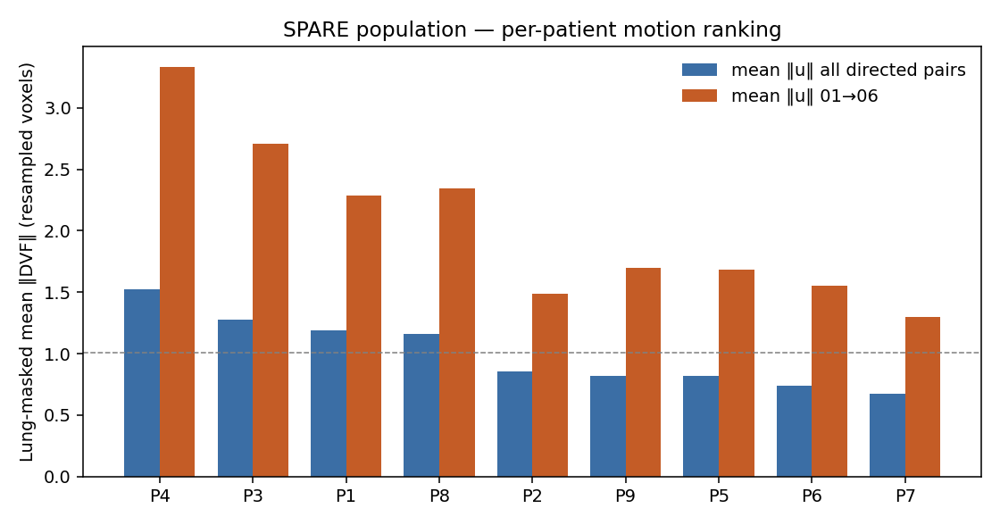

## Per-patient summary

| Patient | Mean ‖u‖ (all directed) | 01→06 ‖u‖ | Peak pair (by mean ‖u‖) | Peak ‖u‖ | Diaphragm (z,y,x) | Traj peak ‖u‖ @ phase |
|---------|-------------------------|-----------|-------------------------|----------|-------------------|------------------------|
| P4 | 1.522 | 3.331 | `01_to_06` | 3.331 | (121,109,42) | 1.35 @ 06 |
| P3 | 1.276 | 2.707 | `01_to_06` | 2.707 | (121,74,85) | 1.38 @ 07 |
| P1 | 1.192 | 2.289 | `10_to_06` | 2.366 | (121,86,41) | 0.62 @ 08 |
| P8 | 1.157 | 2.342 | `01_to_07` | 2.362 | (120,109,50) | 1.38 @ 07 |
| P2 | 0.856 | 1.485 | `01_to_07` | 1.570 | (119,106,60) | 1.30 @ 07 |
| P9 | 0.819 | 1.699 | `06_to_01` | 1.735 | (121,113,81) | 1.75 @ 07 |
| P5 | 0.816 | 1.684 | `06_to_01` | 1.697 | (121,66,56) | 0.35 @ 07 |
| P6 | 0.739 | 1.556 | `06_to_01` | 1.618 | (119,109,64) | 1.23 @ 07 |
| P7 | 0.677 | 1.298 | `01_to_06` | 1.298 | (121,110,55) | 0.83 @ 08 |

## Pair-wise heatmaps

Each panel is mean lung-masked ‖DVF‖ for ref→tgt (diagonal = identity ≈ 0).

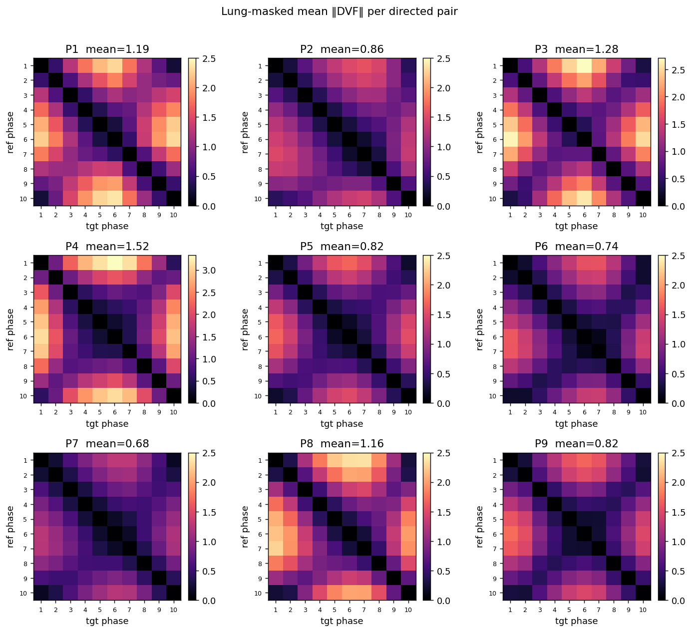

## Diaphragm landmark trajectories

Landmark = centroid of a near-caudal lung-mask slice (diaphragm dome region) on phase **01**.
Displacement sampled from `01_to_{phase}_pair.npy` at that fixed grid index.

### P4

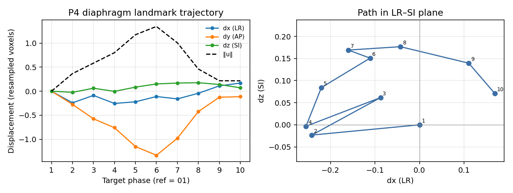

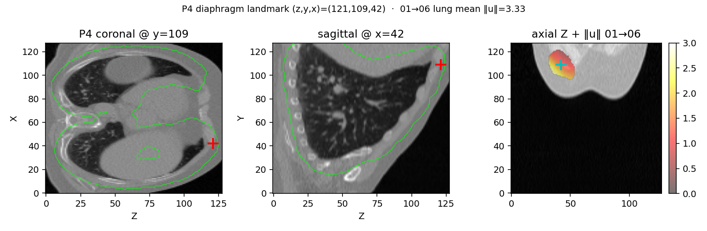

| Phase | dx | dy | dz | ‖u‖ |
|------:|---:|---:|---:|----:|
| 01 | 0.000 | 0.000 | 0.000 | 0.000 |
| 02 | -0.242 | -0.274 | -0.023 | 0.367 |
| 03 | -0.087 | -0.574 | 0.062 | 0.584 |
| 04 | -0.255 | -0.759 | -0.003 | 0.801 |
| 05 | -0.220 | -1.150 | 0.084 | 1.174 |
| 06 | -0.111 | -1.333 | 0.151 | 1.347 |
| 07 | -0.160 | -0.979 | 0.169 | 1.006 |
| 08 | -0.043 | -0.424 | 0.177 | 0.461 |
| 09 | 0.111 | -0.125 | 0.139 | 0.218 |
| 10 | 0.169 | -0.114 | 0.071 | 0.216 |

### P3

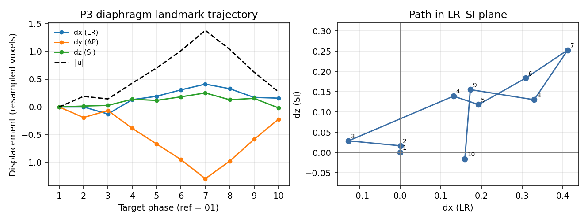

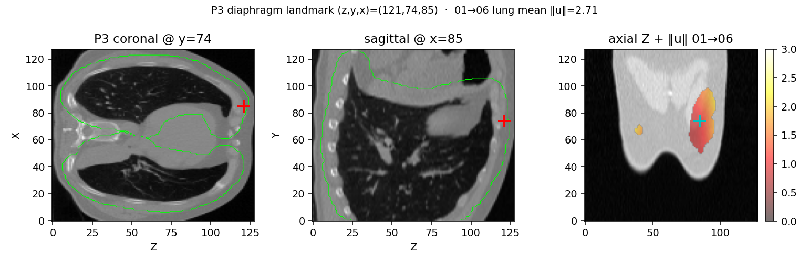

| Phase | dx | dy | dz | ‖u‖ |
|------:|---:|---:|---:|----:|
| 01 | 0.000 | 0.000 | 0.000 | 0.000 |
| 02 | 0.001 | -0.191 | 0.017 | 0.191 |
| 03 | -0.127 | -0.064 | 0.029 | 0.145 |
| 04 | 0.131 | -0.385 | 0.139 | 0.430 |
| 05 | 0.193 | -0.666 | 0.118 | 0.703 |
| 06 | 0.309 | -0.948 | 0.183 | 1.014 |
| 07 | 0.412 | -1.292 | 0.253 | 1.380 |
| 08 | 0.330 | -0.976 | 0.130 | 1.038 |
| 09 | 0.173 | -0.584 | 0.155 | 0.628 |
| 10 | 0.159 | -0.222 | -0.016 | 0.274 |

### P1

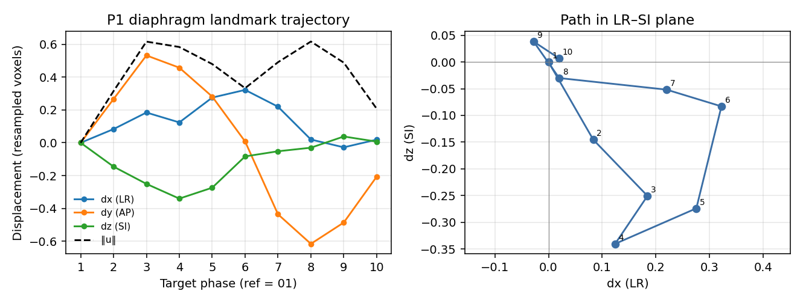

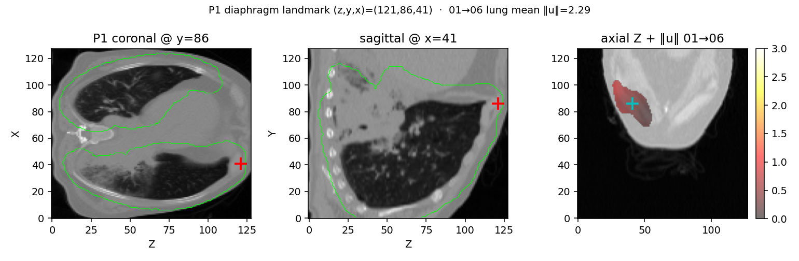

| Phase | dx | dy | dz | ‖u‖ |
|------:|---:|---:|---:|----:|
| 01 | 0.000 | 0.000 | 0.000 | 0.000 |
| 02 | 0.083 | 0.266 | -0.145 | 0.315 |
| 03 | 0.184 | 0.532 | -0.251 | 0.616 |
| 04 | 0.124 | 0.458 | -0.340 | 0.584 |
| 05 | 0.275 | 0.282 | -0.274 | 0.480 |
| 06 | 0.322 | 0.008 | -0.083 | 0.333 |
| 07 | 0.220 | -0.436 | -0.052 | 0.491 |
| 08 | 0.020 | -0.616 | -0.030 | 0.617 |
| 09 | -0.028 | -0.486 | 0.038 | 0.488 |
| 10 | 0.019 | -0.207 | 0.007 | 0.208 |

### P8

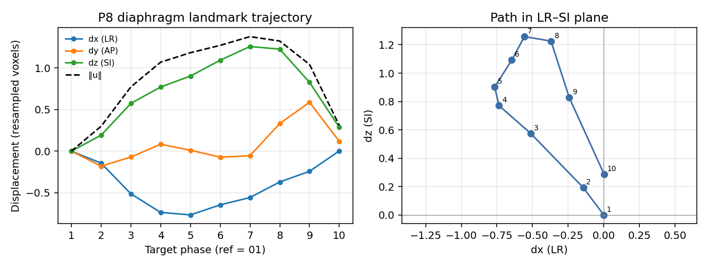

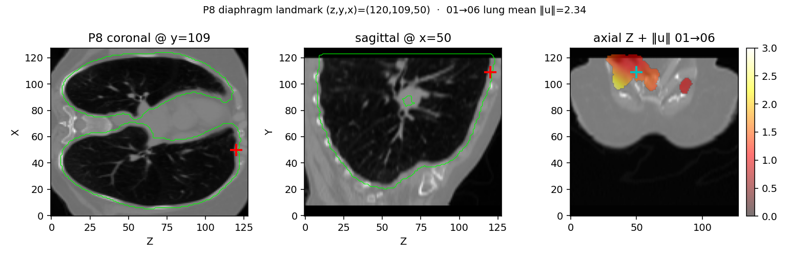

| Phase | dx | dy | dz | ‖u‖ |
|------:|---:|---:|---:|----:|
| 01 | 0.000 | 0.000 | 0.000 | 0.000 |
| 02 | -0.144 | -0.179 | 0.192 | 0.299 |
| 03 | -0.512 | -0.071 | 0.574 | 0.773 |
| 04 | -0.736 | 0.084 | 0.771 | 1.069 |
| 05 | -0.765 | 0.011 | 0.902 | 1.183 |
| 06 | -0.645 | -0.072 | 1.093 | 1.271 |
| 07 | -0.557 | -0.055 | 1.258 | 1.376 |
| 08 | -0.370 | 0.332 | 1.226 | 1.323 |
| 09 | -0.242 | 0.587 | 0.827 | 1.043 |
| 10 | 0.003 | 0.119 | 0.286 | 0.309 |

### P2

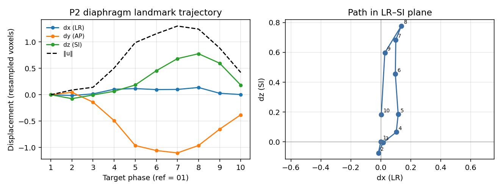

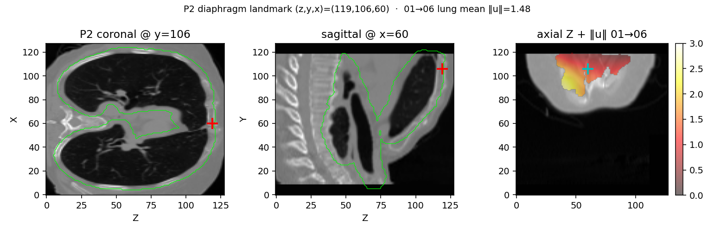

| Phase | dx | dy | dz | ‖u‖ |
|------:|---:|---:|---:|----:|
| 01 | 0.000 | 0.000 | 0.000 | 0.000 |
| 02 | -0.015 | 0.046 | -0.074 | 0.089 |
| 03 | 0.016 | -0.140 | -0.005 | 0.141 |
| 04 | 0.104 | -0.490 | 0.065 | 0.505 |
| 05 | 0.116 | -0.963 | 0.184 | 0.987 |
| 06 | 0.097 | -1.058 | 0.455 | 1.155 |
| 07 | 0.101 | -1.103 | 0.684 | 1.301 |
| 08 | 0.137 | -0.962 | 0.777 | 1.244 |
| 09 | 0.027 | -0.653 | 0.598 | 0.886 |
| 10 | 0.004 | -0.380 | 0.183 | 0.422 |

### P9

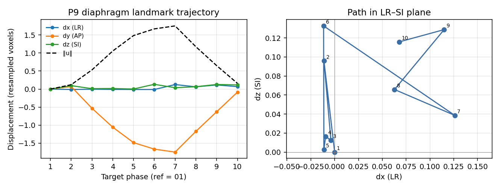

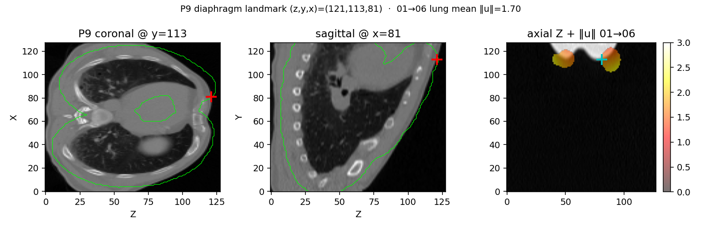

| Phase | dx | dy | dz | ‖u‖ |
|------:|---:|---:|---:|----:|
| 01 | 0.000 | 0.000 | 0.000 | 0.000 |
| 02 | -0.011 | 0.072 | 0.096 | 0.121 |
| 03 | -0.004 | -0.531 | 0.012 | 0.531 |
| 04 | -0.009 | -1.055 | 0.017 | 1.055 |
| 05 | -0.011 | -1.483 | 0.002 | 1.483 |
| 06 | -0.012 | -1.663 | 0.133 | 1.668 |
| 07 | 0.126 | -1.746 | 0.039 | 1.751 |
| 08 | 0.063 | -1.170 | 0.066 | 1.174 |
| 09 | 0.115 | -0.627 | 0.129 | 0.650 |
| 10 | 0.068 | -0.085 | 0.116 | 0.159 |

### P5

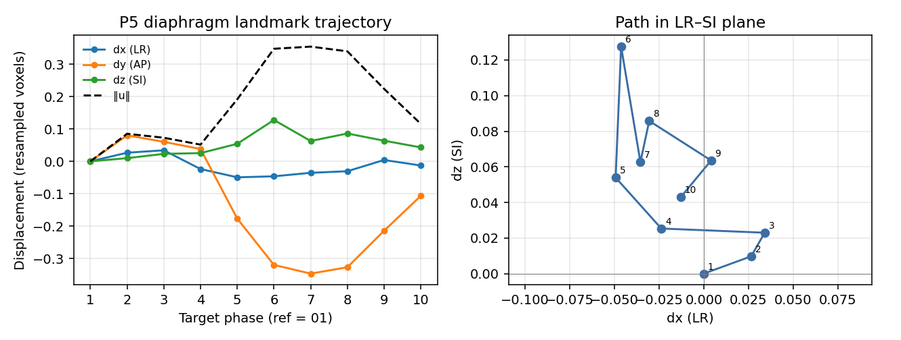

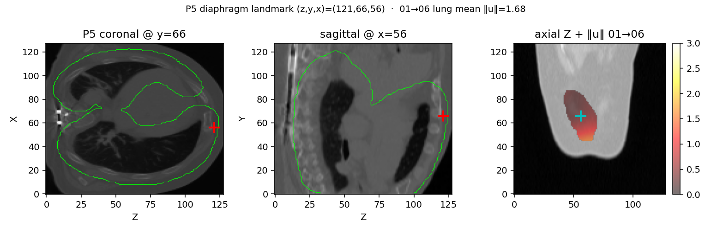

| Phase | dx | dy | dz | ‖u‖ |
|------:|---:|---:|---:|----:|
| 01 | 0.000 | 0.000 | 0.000 | 0.000 |
| 02 | 0.026 | 0.080 | 0.010 | 0.085 |
| 03 | 0.034 | 0.060 | 0.023 | 0.073 |
| 04 | -0.024 | 0.038 | 0.025 | 0.051 |
| 05 | -0.049 | -0.177 | 0.054 | 0.191 |
| 06 | -0.046 | -0.320 | 0.128 | 0.347 |
| 07 | -0.036 | -0.347 | 0.063 | 0.354 |
| 08 | -0.031 | -0.327 | 0.086 | 0.339 |
| 09 | 0.004 | -0.214 | 0.064 | 0.224 |
| 10 | -0.013 | -0.107 | 0.043 | 0.116 |

### P6

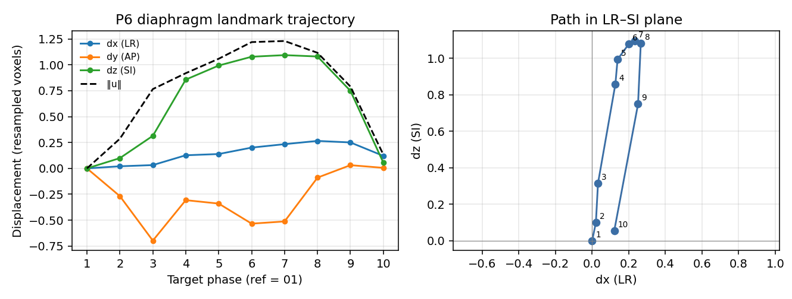

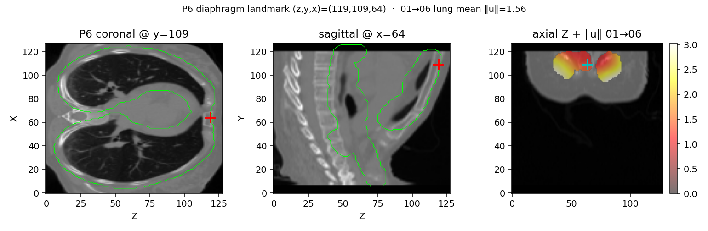

| Phase | dx | dy | dz | ‖u‖ |
|------:|---:|---:|---:|----:|
| 01 | 0.000 | 0.000 | 0.000 | 0.000 |
| 02 | 0.020 | -0.268 | 0.099 | 0.287 |
| 03 | 0.032 | -0.698 | 0.315 | 0.766 |
| 04 | 0.127 | -0.307 | 0.858 | 0.920 |
| 05 | 0.139 | -0.340 | 0.994 | 1.059 |
| 06 | 0.201 | -0.534 | 1.079 | 1.220 |
| 07 | 0.234 | -0.513 | 1.094 | 1.231 |
| 08 | 0.265 | -0.089 | 1.081 | 1.117 |
| 09 | 0.251 | 0.031 | 0.749 | 0.790 |
| 10 | 0.121 | 0.005 | 0.055 | 0.133 |

### P7

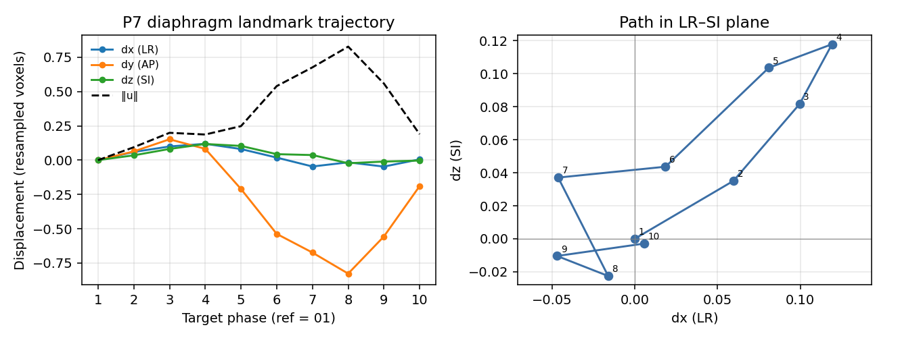

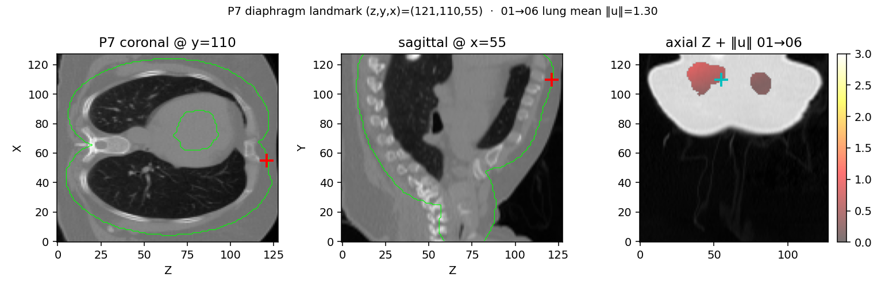

| Phase | dx | dy | dz | ‖u‖ |
|------:|---:|---:|---:|----:|
| 01 | 0.000 | 0.000 | 0.000 | 0.000 |
| 02 | 0.060 | 0.064 | 0.035 | 0.094 |
| 03 | 0.100 | 0.152 | 0.082 | 0.199 |
| 04 | 0.119 | 0.082 | 0.118 | 0.187 |
| 05 | 0.081 | -0.210 | 0.104 | 0.248 |
| 06 | 0.019 | -0.538 | 0.044 | 0.540 |
| 07 | -0.046 | -0.674 | 0.037 | 0.677 |
| 08 | -0.016 | -0.827 | -0.023 | 0.828 |
| 09 | -0.047 | -0.557 | -0.010 | 0.559 |
| 10 | 0.006 | -0.189 | -0.003 | 0.189 |

## Files

| File | Content |
|------|---------|
| `metrics_per_patient.tsv` | Ranking + landmark + summary scalars |
| `metrics_per_pair.tsv` | All 100 pairs × 9 patients |
| `summary.json` | Machine-readable copy of the ranking |
| `plots/` | Ranking, heatmaps, trajectories, QC overlays |
