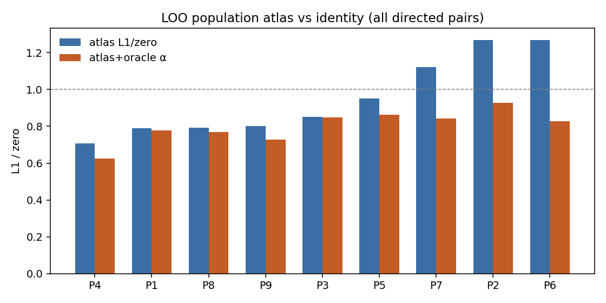
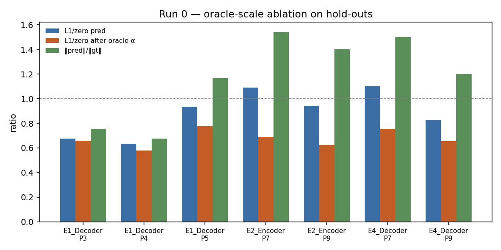

# Run 0 diagnostics (P0-B)

No training. Confirms whether **amplitude** (H1) is the dominant population failure.

## Verdict checklist

- **E2 Encoder P7:** L1/zero 1.09 → oracle 0.69 (α≈0.55, amp_ratio=1.54). **H1 supported** (oracle ≤ 0.75).
- **E1 Decoder hold-outs:** P3 0.68→0.66, P4 0.64→0.58, P5 0.93→0.78

## 1. LOO population atlas

Mean DVF of the other 8 patients on the shared 128³ grid (same phase pair). No learning.

| Patient | L1/zero atlas | L1/zero atlas+α | mean α | cos | beat zero % |
|---------|---------------|-----------------|--------|-----|-------------|
| P4 | 0.71 | 0.62 | 1.77 | 0.808 | 100% |
| P1 | 0.79 | 0.78 | 1.29 | 0.676 | 98% |
| P8 | 0.79 | 0.77 | 0.97 | 0.672 | 87% |
| P9 | 0.80 | 0.73 | 0.82 | 0.731 | 86% |
| P3 | 0.85 | 0.85 | 1.25 | 0.595 | 93% |
| P5 | 0.95 | 0.86 | 0.63 | 0.514 | 68% |
| P7 | 1.12 | 0.84 | 0.60 | 0.658 | 26% |
| P2 | 1.27 | 0.93 | 0.39 | 0.366 | 22% |
| P6 | 1.27 | 0.83 | 0.45 | 0.553 | 38% |

## 2. Model oracle-scale (hold-outs)

| Model | Patient | L1/zero | oracle L1/zero | α | ‖pred‖/‖gt‖ | cos | beat% | beat% after α |
|-------|---------|---------|----------------|---|-------------|-----|-------|---------------|
| E1_Decoder | P3 | 0.68 | 0.66 | 1.04 | 0.75 | 0.767 | 100% | 100% |
| E1_Decoder | P4 | 0.64 | 0.58 | 1.28 | 0.67 | 0.825 | 100% | 100% |
| E1_Decoder | P5 | 0.93 | 0.78 | 0.59 | 1.16 | 0.687 | 82% | 100% |
| E2_Encoder | P7 | 1.09 | 0.69 | 0.55 | 1.54 | 0.773 | 47% | 100% |
| E2_Encoder | P9 | 0.94 | 0.63 | 0.62 | 1.40 | 0.789 | 66% | 100% |
| E4_Decoder | P7 | 1.10 | 0.75 | 0.57 | 1.50 | 0.753 | 40% | 100% |
| E4_Decoder | P9 | 0.83 | 0.66 | 0.72 | 1.20 | 0.779 | 78% | 100% |

## 3. GT-warp sanity

Lung-masked image L1 of `warp(ref, gt_dvf)` vs target CT (normed). Should be **much smaller** than identity warp residual.

| Patient | mean img L1 (GT warp) | mean img L1 (identity) | GT/id |
|---------|-----------------------|------------------------|-------|
| P1 | 0.0212 | 0.0319 | 0.66 |
| P2 | 0.0358 | 0.0429 | 0.83 |
| P3 | 0.0179 | 0.0335 | 0.53 |
| P4 | 0.0142 | 0.0246 | 0.57 |
| P5 | 0.0065 | 0.0113 | 0.58 |
| P6 | 0.0279 | 0.0355 | 0.78 |
| P7 | 0.0097 | 0.0180 | 0.54 |
| P8 | 0.0311 | 0.0376 | 0.83 |
| P9 | 0.0221 | 0.0271 | 0.81 |

## Files

- `atlas_per_pair.tsv` / `atlas_per_patient.tsv`
- `model_oracle_per_pair.tsv` / `model_oracle_per_patient.tsv`
- `gt_warp.tsv`
- `summary.json`

Next (still Run 0): **P0-A** common-mm regrid · **P0-C** LOPO model selection. Then **E6** amplitude-decoupled Decoder if H1 holds.
